# 🎤 Eleven - ElevenLabs TTS Streaming App

A React Native application that converts text to speech using the ElevenLabs API with real-time streaming playback and smooth visual animations.

## ✨ Features

- **Real-time TTS Streaming**: Converts text to speech with ElevenLabs API
- **Smooth Audio Playback**: Uses `react-native-track-player` for reliable streaming
- **Background Audio Support**: Continues playing when app is backgrounded
- **Beautiful Animations**: Neon cyan pulsing animation during playback
- **Chunk-based Streaming**: Intelligent buffering for seamless audio experience
- **Auto-cleanup**: Smart memory management for optimal performance

## 🏗️ Architecture

```mermaid
graph TD
    A["🎯 User Input Text"] --> B["🌐 ElevenLabs API Stream"]
    B --> C["📦 PCM Chunks Received"]
    C --> D["🔄 Buffer Manager<br/>(128KB chunks)"]
    D --> E["🎵 Audio Proxy<br/>PCM → WAV Conversion"]
    E --> F["💾 File System<br/>WAV files"]
    F --> G["🎶 TrackPlayer Queue"]
    G --> H["🔊 Audio Playback"]
    
    I["📡 TrackPlayer Events"] --> J["🧹 Cleanup Manager"]
    J --> K["🗑️ Remove Old Files"]
    
    subgraph "Streaming Pipeline"
        D
        E
        F
    end
    
    subgraph "Audio Management"
        G
        H
        I
    end
    
    subgraph "Memory Optimization"
        J
        K
    end
    
    style A fill:#00DFFF,stroke:#333,stroke-width:2px
    style H fill:#00DFFF,stroke:#333,stroke-width:2px
    style G fill:#90EE90,stroke:#333,stroke-width:2px
```



## 🚀 How It Works

### 1. **Text Processing**
- User enters text in the auto-resizing input field
- Text is sanitized and sent to ElevenLabs API for TTS generation

### 2. **Streaming Pipeline**
- ElevenLabs API streams PCM audio data in real-time
- PCM data is buffered into 128KB chunks (~4 seconds each)
- Each chunk is converted to WAV format with proper headers
- WAV files are saved to device storage for TrackPlayer consumption

### 3. **Audio Playback**
- TrackPlayer manages a queue of audio chunks
- Playback starts after 3 chunks are buffered (12 seconds buffer)
- Smooth transitions between chunks for continuous audio
- Background playback support with media controls

### 4. **Memory Management**
- Automatic cleanup of old audio files during playback
- Progressive removal of chunks 3+ positions behind current track
- Complete cleanup when playback ends

## 📱 Tech Stack

- **React Native 0.79.2** - Cross-platform mobile framework
- **TypeScript** - Type-safe development
- **ElevenLabs API** - AI-powered text-to-speech
- **react-native-track-player** - Professional audio playback
- **react-native-blob-util** - File operations and HTTP streaming
- **react-native-vector-icons** - UI icons
- **Buffer** - Binary data manipulation

## 🔧 Technical Details

### Audio Configuration
- **Sample Rate**: 16kHz
- **Channels**: Mono (1 channel)
- **Bit Depth**: 16-bit
- **Format**: PCM → WAV conversion
- **Chunk Size**: 128KB (~4 seconds)
- **Buffer**: 3 chunks (12 seconds)

### ElevenLabs API
- **Endpoint**: `/v1/text-to-speech/{voice_id}/stream`
- **Voice ID**: `JBFqnCBsd6RMkjVDRZzb`
- **Model**: `eleven_flash_v2`
- **Output Format**: `pcm_16000`

### TrackPlayer Features
- Background audio capability
- Lock screen media controls
- Automatic queue management
- Platform-optimized performance

## 🛠️ Setup Instructions

### Prerequisites
- Node.js (≥18)
- React Native development environment
- Xcode (for iOS)
- Android Studio (for Android)

### Installation

1. **Clone the repository**
```bash
git clone https://github.com/Jitendra2603/ElevenLabsRNStream.git
cd ElevenLabsRNStream
```

2. **Install dependencies**
```bash
npm install
```

3. **iOS Setup**
```bash
cd ios && pod install && cd ..
```

4. **Configure ElevenLabs API**
- Get your API key from [ElevenLabs](https://elevenlabs.io)
- Update `ELEVEN_API_KEY` in `App.tsx`

5. **Run the app**
```bash
# iOS
npx react-native run-ios

# Android
npx react-native run-android
```

## 🔑 Environment Variables

Create a `.env` file (optional):
```env
ELEVEN_API_KEY=your_elevenlabs_api_key_here
VOICE_ID=JBFqnCBsd6RMkjVDRZzb
```

## 📁 Project Structure

```
Eleven/
├── App.tsx                 # Main app component
├── index.js               # App entry point with TrackPlayer service
├── components/
│   ├── AutoResizingTextInput.tsx
│   └── PlayingAnimator.tsx
├── services/
│   ├── audioProxy.ts      # PCM to WAV conversion
│   ├── elevenLabs.ts      # ElevenLabs API integration
│   ├── streamingTts.ts    # Main streaming service
│   ├── trackPlayerService.ts
│   └── trackPlayerSetup.ts
├── src/types/             # TypeScript declarations
├── ios/                   # iOS native code
└── android/               # Android native code
```

## 🎨 UI Components

### PlayingAnimator
- Multi-layered pulsing animation
- Neon cyan theme (#00DFFF)
- Core and glow effects
- React Native Animated API

### AutoResizingTextInput
- Dynamic height adjustment
- Send button integration
- Keyboard-aware interface
- Styled with React Native StyleSheet

## 🔧 Performance Optimizations

1. **Chunked Streaming**: 128KB chunks prevent memory buildup
2. **Progressive Cleanup**: Removes old files during playback
3. **Smart Buffering**: 3-chunk buffer prevents audio gaps
4. **File-based Playback**: Reliable than in-memory streaming
5. **Background Processing**: Non-blocking audio operations

## 🐛 Troubleshooting

### Common Issues

**White Noise in Audio**
- Check PCM data integrity
- Verify WAV header generation
- Ensure proper chunk alignment

**Playback Stops Early**
- Check TrackPlayer queue status
- Verify chunk file creation
- Monitor cleanup timing

**Memory Issues**
- Check file cleanup process
- Monitor temp directory size
- Verify chunk removal logic

### Debug Logs
Enable detailed logging by checking console output:
```javascript
console.log('Buffer size:', bufferSize);
console.log('Created WAV:', wavSize);
console.log('Queue length:', queueLength);
```

## 🤝 Contributing

1. Fork the repository
2. Create a feature branch (`git checkout -b feature/amazing-feature`)
3. Commit your changes (`git commit -m 'Add amazing feature'`)
4. Push to the branch (`git push origin feature/amazing-feature`)
5. Open a Pull Request

## 📄 License

This project is licensed under the MIT License - see the [LICENSE](LICENSE) file for details.

## 🙏 Acknowledgments

- [ElevenLabs](https://elevenlabs.io) for the amazing TTS API
- [react-native-track-player](https://github.com/doublesymmetry/react-native-track-player) team
- React Native community for excellent tooling

## 📧 Contact

- **GitHub**: [@Jitendra2603](https://github.com/Jitendra2603)
- **Repository**: [ElevenLabsRNStream](https://github.com/Jitendra2603/ElevenLabsRNStream)

---

**Built with ❤️ using React Native and ElevenLabs AI**
